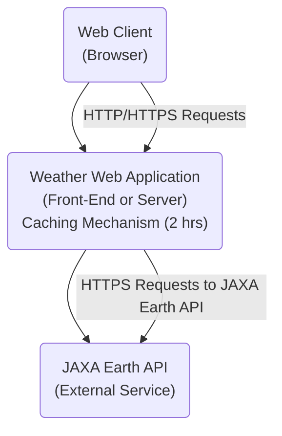

# System Specification

## 1. Introduction

This specification describes a **web-based Weather Application** that displays current weather information for Tokyo and Nasushiobara, leveraging the **JAXA Earth API**. The document details the system’s architecture, data flows, user interface design, caching strategy, error handling, and how non-functional requirements (performance, security, etc.) are addressed.

### 1.1 Purpose

- **Primary Goal**: Provide up-to-date weather information (temperature, relative humidity, and status) for two specific cities (Tokyo, Nasushiobara).  
- **Secondary Goals**:  
  - Keep the application available and responsive (24/7).  
  - Ensure minimal downtime, good performance, and adherence to JAXA Earth API usage policies.

### 1.2 Scope

- **In Scope**:  
  - A webpage that fetches and displays weather data at least every 60 minutes or on user demand.  
  - Error handling and caching to reduce API load.  
  - Logging and monitoring for troubleshooting.  
- **Out of Scope**:  
  - Forecast beyond current conditions.  
  - Additional cities (though the system should be extensible).

---

## 2. System Overview

1. **Client-Side Web App**: A browser-based interface that shows weather data (temperature, humidity, weather icon/status) for Tokyo and Nasushiobara side-by-side.  
2. **Data Provider**: JAXA Earth API, accessed via secure HTTP requests.  
3. **Caching Layer**: Temporary storage to keep weather data for up to 2 hours, avoiding frequent re-queries.  
4. **Hosting Environment**: Cloud-based or container-based deployment to ensure easy scalability and minimal downtime.  
5. **Users**: Anyone with a modern browser (desktop or mobile).

---

## 3. Architecture and Components

This application follows a **typical client-server model**. The high-level architecture is shown below:

### 3.1 Front-End / Back-End Responsibilities
- Depending on the chosen architecture:
  1. **Pure Client-Side Approach**: The browser fetches data directly from the JAXA Earth API (through a secure proxy to hide API keys) and uses local storage or session storage for caching.  
  2. **Server-Side / API Proxy Approach**: A simple back-end acts as a proxy and caches responses from JAXA Earth API for 2 hours. The front-end fetches data from this back-end service.

### 3.2 Caching Strategy
- Data is stored (in server memory, a small in-memory database, or browser local storage) for **up to 2 hours**.  
- If fresh data (< 2 hours old) is available, the UI shows the cached data.  
- If older or missing, the system fetches new data from JAXA Earth API.

### 3.3 Error Handling
- If the JAXA Earth API is unreachable or returns an error, the system displays a friendly message: “Weather data currently unavailable.”  
- Logs the error details for troubleshooting (server logs, or front-end logging if purely client-based).

---

## 4. Data Flow

1. **User Opens Webpage**  
   - **Load/Refresh** triggers a request for weather data (Tokyo, Nasushiobara).  
   - Check local cache (or server cache) for fresh data.  

2. **Cache Check**  
   - **IF** cached data for each city is < 2 hours old, use the cached data.  
   - **ELSE** call the JAXA Earth API for updated info.  

3. **JAXA Earth API Call**  
   - Request the necessary endpoints for temperature, relative humidity, and weather status/icons.  
   - On success: parse JSON response, update the cache, and display data.  
   - On failure: handle gracefully (log error, show user-friendly notice).

4. **UI Rendering**  
   - Display updated weather data for both cities side-by-side, including timestamp of the last successful update.

---

## 5. User Interface Specification

1. **Layout**  
   - A single webpage with **two main panels**: one for Tokyo, one for Nasushiobara.  
   - Each panel shows:  
     - **City Name** (e.g., “Tokyo”)  
     - **Temperature** (in °C, or user-chosen unit if extended in future)  
     - **Relative Humidity** (in %)  
     - **Weather Icon** (e.g., sun, cloud, rain icon)  
     - **Last Update Time** (e.g., “Last updated: 12:45 PM JST”)  

2. **Styling**  
   - Simple, clean layout optimized for both desktop and mobile screens (responsive design).  
   - Minimal color scheme so data remains the focus.

3. **Refresh Mechanism**  
   - **Auto-Refresh**: Data fetched at least every 60 minutes.  
   - **Manual Refresh**: A “Refresh” button that forces a new fetch (bypassing the cache).  

4. **Error Messages**  
   - If the API fails, show a message: “Weather data currently unavailable. Please try again later.”  

---

## 6. Error Handling & Logging Specification

- **Client-Side Errors**  
  - Display a toast, modal, or inline alert if data retrieval fails.  
  - Optionally log the error to a remote logging service or server logs if client-based.  

- **Server-Side Logging**  
  - If a back-end proxy is used, log the following data:
    - Timestamp of the request  
    - Endpoint called (JAXA Earth API endpoint)  
    - Response status or error message  
    - (Optional) Stack trace if an exception occurred  

- **API Rate Limits**  
  - If rate limits are reached, show a fallback message or degrade gracefully (use older cached data if available).

---

## 7. Non-Functional Requirements Fulfillment

Below is how the system addresses each NFR:

1. **Performance**  
   - **Load Time**: The static front-end or lightweight server ensures the webpage loads within 2–3 seconds on typical broadband.  
   - **API Call Optimization**: Using a 2-hour cache prevents unnecessary calls and speeds up load times.

2. **Reliability & Availability**  
   - **24/7 Uptime**: Host on a reliable platform (AWS, Azure, or similar) with minimal downtime.  
   - **Monitoring**: Basic health checks and uptime monitoring to detect outages. Possibly use a third-party service or built-in cloud monitoring.

3. **Scalability**  
   - Deploy as a **containerized app** (Docker, Kubernetes) or on a serverless platform if needed.  
   - Scale horizontally if user traffic spikes.

4. **Security & Data Privacy**  
   - All traffic served over **HTTPS**.  
   - **API Key Management**: Use environment variables and keep keys out of client-side code. Possibly store keys in a secure vault or parameter store.  
   - Minimal user data is collected (only usage logs), so privacy concerns are low.

5. **Maintainability**  
   - **Modular Code Structure**: For easy updates if the JAXA Earth API changes.  
   - **Documentation**: A README or wiki explaining setup, deployment, and environment variables.  
   - **Version Control**: Git repository hosting the code, with CI/CD pipeline to automate builds and tests.

6. **Monitoring & Logging**  
   - Integrate with a logging/monitoring system (e.g., ELK Stack, Grafana, or CloudWatch) to track errors and performance.  
   - Possibly track user events/traffic for future analysis.

7. **API Usage and Rate Limits**  
   - The 2-hour cache significantly reduces calls to JAXA Earth API.  
   - If the API enforces daily request limits, the system avoids exceeding them by limiting manual refresh if needed (e.g., only once every 5 minutes per user).

---

## 8. Technology Stack (Example)

- **Front-End**  
  - HTML5, CSS3, and a lightweight JavaScript framework (e.g., React or Vue) or just plain JavaScript if minimal.  
  - Responsive design for mobile support.

- **Back-End** (Optional if direct from client)  
  - Node.js or Python (Flask/FastAPI) acting as a proxy and caching layer.  
  - In-memory cache (Redis or a simple data store) with TTL = 2 hours.

- **Deployment & Hosting**  
  - Container-based (Docker) or static hosting (AWS S3 + CloudFront) if pure client-based approach.  
  - Automated CI/CD pipeline for easy updates.

---

## 9. Testing & Quality Assurance

1. **Functional Tests**  
   - **Unit Tests**: Validate weather data parsing, caching logic, and error handling.  
   - **Integration Tests**: Mock JAXA Earth API responses to confirm the UI or server logic.  
   - **End-to-End Tests**: Use Cypress or Selenium to ensure the final user experience is correct (page loads, data is displayed).

2. **Performance Tests**  
   - Confirm that under moderate load (simulated user spikes), the page still loads within target times.  
   - Check caching to ensure minimal repeated API calls.

3. **Security Tests**  
   - Validate HTTPS configuration.  
   - Ensure no sensitive API keys are leaked to the client.  
   - Basic vulnerability scans (e.g., OWASP ZAP or similar).

4. **Monitoring & Logging Validation**  
   - Confirm logs are generated for both success and error conditions.  
   - Confirm metrics are visible in monitoring dashboards.

---

## 10. Implementation Constraints & Assumptions

- **Constraints**  
  - Must not exceed JAXA Earth API rate limits.  
  - Must support modern browsers (Chrome, Firefox, Safari, Edge), typically ignoring older IE versions.

- **Assumptions**  
  - JAXA Earth API remains stable and accessible with minimal downtime.  
  - The hosting provider can scale up/down based on usage.  
  - 2-hour cache is sufficient for typical user needs without requiring near-real-time updates.
